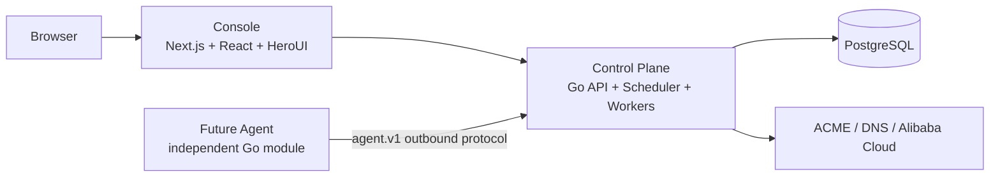

# CertFlow

[](./LICENSE)
[](https://github.com/jaysonwu524/certflow/actions/workflows/control-plane-ci.yml)
[](https://github.com/jaysonwu524/certflow/actions/workflows/console-ci.yml)
[](https://go.dev/)
[](https://github.com/jaysonwu524?tab=packages&repo_name=certflow)

[English](./README.md) | [简体中文](./README.zh-CN.md)


**Open-source TLS certificate lifecycle automation for ACME, DNS, cloud certificate stores, and load balancers.**

> CertFlow is currently an MVP / early-development project. Review the security, backup, and integration guidance before using it with production credentials or domains.

## Why CertFlow

Certificate operations often span ACME accounts, DNS credentials, certificate stores, load balancers, renewal schedules, audit records, and failure notifications. CertFlow brings those steps into one auditable control plane while keeping private keys and cloud secrets encrypted at rest.

## Capabilities

| Capability | Status | Details |
| --- | --- | --- |
| Certificate issuance | Supported | ACME DNS-01, manual TXT validation, SAN and wildcard certificates |
| Certificate lifecycle | Supported | Versioned certificates, renewal workflows, execution history |
| Alibaba Cloud integration | Supported | DNS, SSL Certificate Management, ALB HTTPS/QUIC listeners |
| Automation | Supported | Renewal, upload to SSL Certificate Management, ALB updates |
| Notifications | Supported | SSE status updates, in-app messages, email, failure Webhooks |
| Access control | Supported | Administrator and user roles with resource ownership checks |
| Remote Agent | Planned | Independent execution plane for managed networks |
| Other providers / OIDC | Planned | Extension points are reserved for future releases |

## Architecture



The Console is a user interface and same-origin BFF. The Control Plane owns authentication, authorization, certificate issuance, external cloud operations, task execution, notifications, and database migrations. A future Agent will be independently deployed and must not access the Control Plane database or import its internal packages.

## Quick Start

The fastest self-hosted path uses the published GHCR images and bundled PostgreSQL. It does not require checking out the application source code on the production server.

```bash
mkdir -p /opt/certflow/deploy/compose
cd /opt/certflow

curl -fsSL https://raw.githubusercontent.com/jaysonwu524/certflow/main/deploy/compose/docker-compose.prod.yml \
  -o deploy/compose/docker-compose.prod.yml
curl -fsSL https://raw.githubusercontent.com/jaysonwu524/certflow/main/.env.production.example \
  -o .env.production.example
cp .env.production.example .env.production
chmod 600 .env.production
```

Edit `.env.production` and replace the PostgreSQL password, administrator password, and encryption key. Generate the encryption key with:

```bash
openssl rand -base64 32
```

Start CertFlow:

```bash
docker compose --env-file .env.production \
  -f deploy/compose/docker-compose.prod.yml up -d
```

Open the HTTPS hostname configured in your reverse proxy. The bundled Console listens on `127.0.0.1:3000`; PostgreSQL and the Control Plane port must not be exposed directly to the public internet. The Control Plane automatically applies embedded `golang-migrate` migrations and initializes the first administrator.

Forks or private deployments must replace the two `CERTFLOW_*_IMAGE` values with their own GHCR image names before starting.

For Alibaba Cloud RDS or another managed PostgreSQL service, use the external database Compose override described in the [deployment guide](./docs/operations/deployment.md).

## Deployment

- [Bundled PostgreSQL, external PostgreSQL, GHCR publishing, upgrades, and rollback](./docs/operations/deployment.md)
- [Environment variables, administrator initialization, and Secret handling](./docs/operations/configuration.md)
- [PostgreSQL migrations, backups, and recovery](./docs/operations/database.md)

## Product Documentation

### Use CertFlow

- [Certificate lifecycle, SAN, wildcard, DNS validation, and automation](./docs/product/certificate-lifecycle.md)
- [Architecture and domain model](./docs/architecture/overview.md)

### Develop and Contribute

- [Local development and testing](./docs/development/testing.md)
- [Console engineering conventions](./docs/development/console.md)
- [Project structure](./docs/development/project-structure.md)
- [Contribution guide](./CONTRIBUTING.md)

### Security and Operations

- [Security policy](./SECURITY.md)
- [Documentation index](./docs/README.md)

## Roadmap

- Independent remote Agent for private networks and managed hosts
- Additional DNS, certificate store, and load balancer providers
- OIDC / SSO and richer organization-level access control
- OpenAPI-driven client generation and a versioned Agent protocol implementation

## Community and License

Bug reports and feature proposals are welcome through [GitHub Issues](https://github.com/jaysonwu524/certflow/issues). Please read the [contribution guide](./CONTRIBUTING.md) and [security policy](./SECURITY.md) before opening a report.

CertFlow is licensed under the [Apache License 2.0](./LICENSE).
