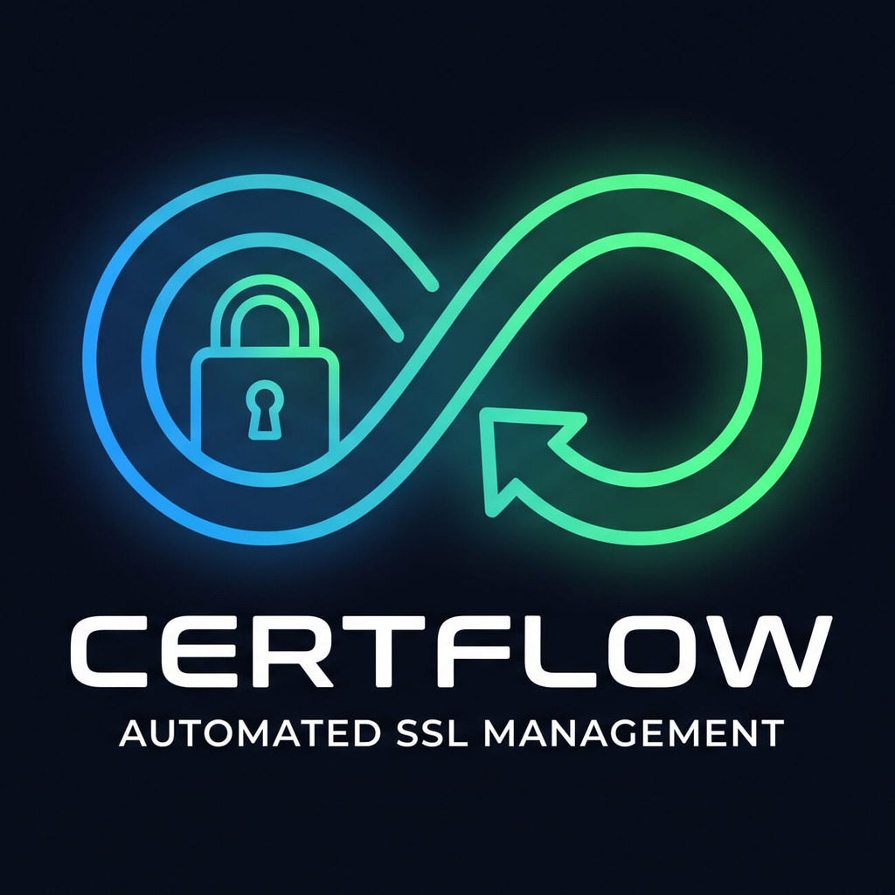
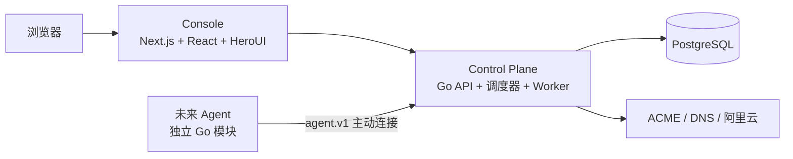

# CertFlow

[](./LICENSE)
[](https://github.com/jaysonwu524/certflow/actions/workflows/control-plane-ci.yml)
[](https://github.com/jaysonwu524/certflow/actions/workflows/console-ci.yml)
[](https://go.dev/)
[](https://github.com/jaysonwu524?tab=packages&repo_name=certflow)

[English](./README.md) | [简体中文](./README.zh-CN.md)



**面向 ACME、DNS、云证书平台和负载均衡器的开源 TLS 证书生命周期自动化平台。**

> CertFlow 当前处于 MVP / 早期开发阶段。将真实域名、云凭证或生产数据库接入前，请先阅读安全、备份和外部集成文档。

## 为什么使用 CertFlow

证书运维通常需要同时处理 ACME 账户、DNS 凭证、证书平台、负载均衡器、续期计划、执行审计和失败通知。CertFlow 将这些步骤集中到一个可审计的控制面中，并对私钥和云凭证进行加密保存。

## 核心能力

| 能力 | 状态 | 说明 |
| --- | --- | --- |
| 证书签发 | 已支持 | ACME DNS-01、手动 TXT 验证、SAN 和通配符证书 |
| 证书生命周期 | 已支持 | 版本化证书、续期流程、执行记录 |
| 阿里云集成 | 已支持 | DNS、SSL 证书管理、ALB HTTPS/QUIC 监听器 |
| 自动化 | 已支持 | 证书续期、上传 SSL 证书管理、更新 ALB |
| 通知 | 已支持 | SSE 状态推送、站内信、邮件、失败 Webhook |
| 权限控制 | 已支持 | 管理员和用户角色、资源归属校验 |
| 远程 Agent | 规划中 | 面向受管网络的独立执行面 |
| 更多云厂商 / OIDC | 规划中 | 已预留扩展边界 |

## 架构概览



Console 负责用户界面和同源 BFF。Control Plane 负责认证授权、证书签发、云操作、任务执行、通知和数据库迁移。未来 Agent 将独立部署，不能访问 Control Plane 数据库或导入其内部包。

## 三分钟快速开始

最快的自托管方式是使用 GHCR 已发布镜像和内置 PostgreSQL。生产服务器不需要检出业务源代码。

```bash
mkdir -p /opt/certflow/deploy/compose
cd /opt/certflow

curl -fsSL https://raw.githubusercontent.com/jaysonwu524/certflow/main/deploy/compose/docker-compose.prod.yml \
  -o deploy/compose/docker-compose.prod.yml
curl -fsSL https://raw.githubusercontent.com/jaysonwu524/certflow/main/.env.production.example \
  -o .env.production.example
cp .env.production.example .env.production
chmod 600 .env.production
```

编辑 `.env.production`，替换 PostgreSQL 密码、管理员密码和加密密钥。生成加密密钥：

```bash
openssl rand -base64 32
```

启动 CertFlow：

```bash
docker compose --env-file .env.production \
  -f deploy/compose/docker-compose.prod.yml up -d
```

通过反向代理配置的 HTTPS 域名访问。内置 Console 只监听 `127.0.0.1:3000`，不要将 PostgreSQL 或 Control Plane 端口直接暴露到公网。Control Plane 启动时会自动执行内嵌的 `golang-migrate` 迁移，并初始化首个管理员。

如果是 Fork 或私有部署，请在启动前将两个 `CERTFLOW_*_IMAGE` 修改为你自己的 GHCR 镜像地址。

如果使用阿里云 RDS 或其他托管 PostgreSQL，请参考[部署文档](./docs/operations/deployment.md)中的外部数据库 Compose 覆盖配置。

## 部署与运维

- [自带 PostgreSQL、外部 PostgreSQL、GHCR 发布、升级和回滚](./docs/operations/deployment.md)
- [环境变量、管理员初始化和 Secret 管理](./docs/operations/configuration.md)
- [PostgreSQL 迁移、备份与恢复](./docs/operations/database.md)

## 产品文档

### 使用 CertFlow

- [证书生命周期、SAN、通配符、DNS 验证和自动化](./docs/product/certificate-lifecycle.md)
- [架构与领域模型](./docs/architecture/overview.md)

### 开发与贡献

- [本地开发与测试](./docs/development/testing.md)
- [Console 工程规范](./docs/development/console.md)
- [项目结构](./docs/development/project-structure.md)
- [贡献指南](./CONTRIBUTING.md)

### 安全

- [安全策略](./SECURITY.md)
- [完整文档索引](./docs/README.md)

## 路线图

- 面向私有网络和受管主机的独立远程 Agent
- 更多 DNS、证书平台和负载均衡器提供商
- OIDC / SSO 与更完整的组织级权限控制
- 基于 OpenAPI 的客户端生成和 Agent 协议实现

## 社区与许可证

欢迎通过 [GitHub Issues](https://github.com/jaysonwu524/certflow/issues) 提交问题和功能建议。提交前请阅读[贡献指南](./CONTRIBUTING.md)和[安全策略](./SECURITY.md)。

CertFlow 采用 [Apache License 2.0](./LICENSE) 开源。
